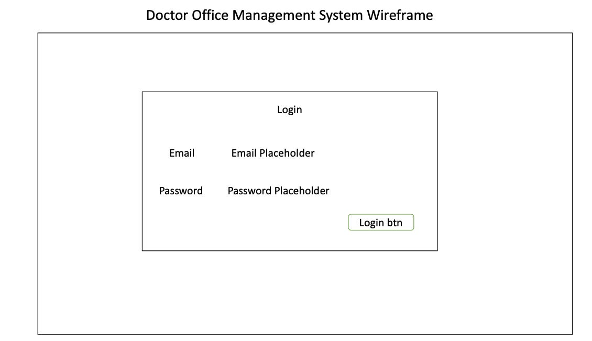
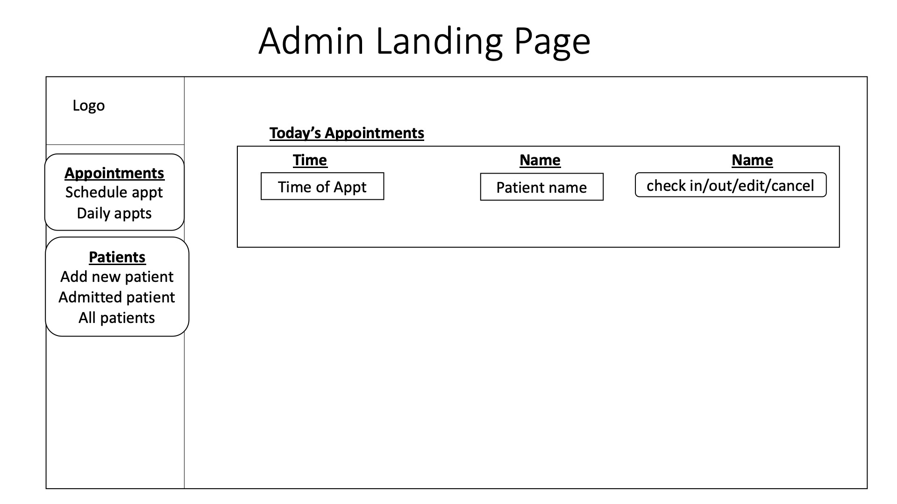
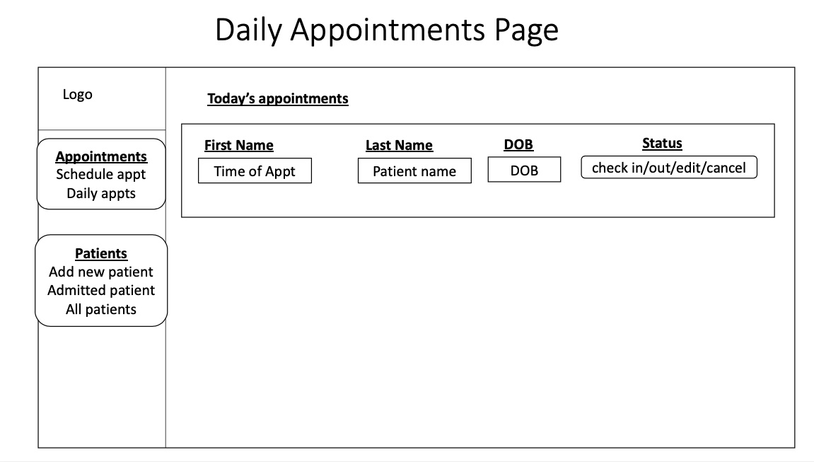
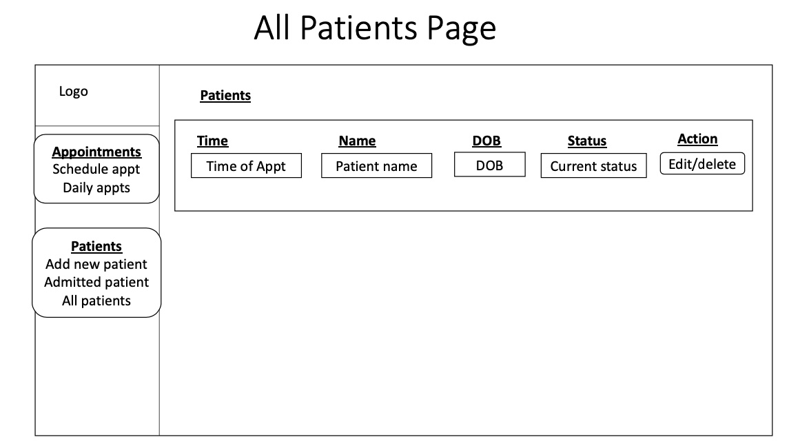
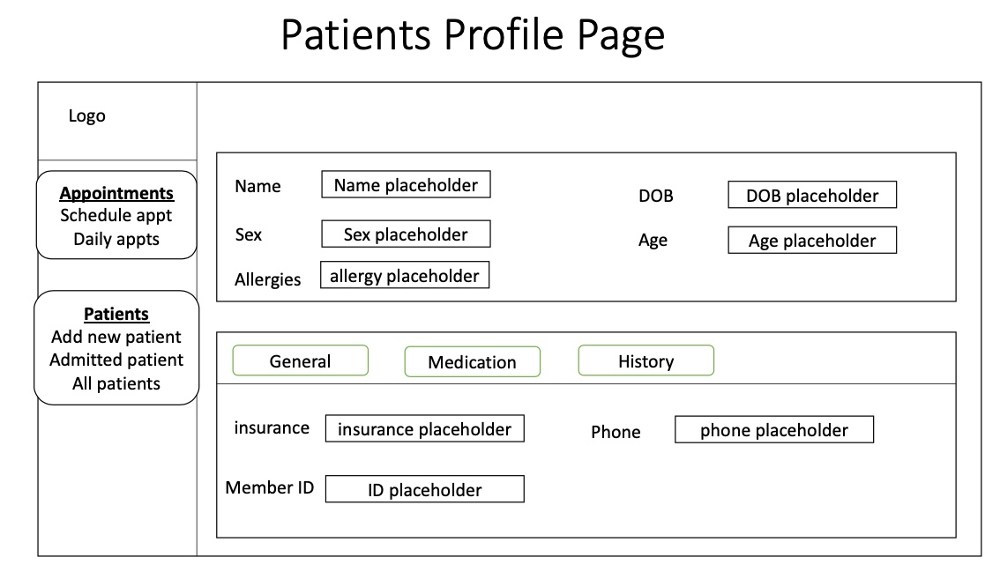

# Doc Manager Client

## Background  
Doc Manager was built to provide an easy to use application for office assistance/secretaries to schedule appointments and update patient profiles. 
## Production Application
Front-End Site: (Link [here](https://oscar-valen115.github.io/doc_manager-client/))  
Front-End Repo: https://github.com/oscar-valen115/doc_manager-client  

Back-End Live API: https://doc-manager-api.herokuapp.com/  
Back-End Repo: https://github.com/oscar-valen115/doc_manager-api

## Technologies Used

- HTML5
- CSS3
- React
- React-Bootstrap
- Styled-Components
- Axios  

## Wireframes

  
  

 
